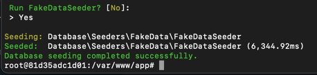

# Command Line choices


This package allows developers to create command line interfaces
for asking questions with a several answers with autocompletion.

### Installation

```bash
composer require lazerg/laravel-choices
```

### Usage with seeder

```php
use Lazerg\LaravelChoices\ChoicesForSeeders;

class DatabaseSeeder extends Seeder
{
    use ChoicesForSeeders;

    public function run()
    {
      $this
          // Possible answers for this choice is: NO, No, no
          // as second argument does not exist, will skip this step
          // if user select this choice
          ->askWithChoices('No')

          // Possible answers for this choice is: YES, Yes, yes
          // If user select this choice, callback on second argument will be run
          ->addChoice('Yes', fn() => $this->call(FakeDataSeeder::class))

          // Second argument here is default answer,
          // if user press enter without answering
          ->ask('Run FakeDataSeeder?', 'No');
    }
}
```


